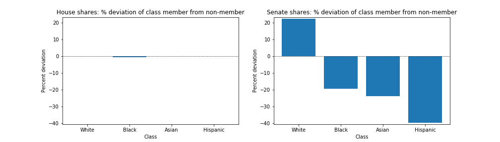
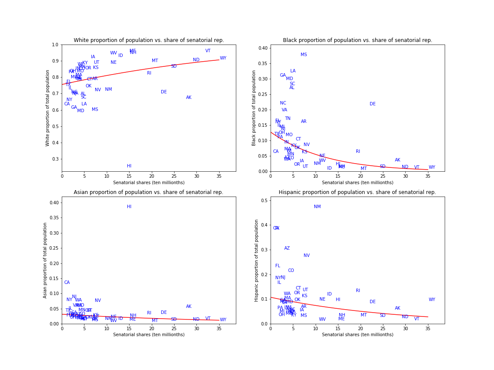
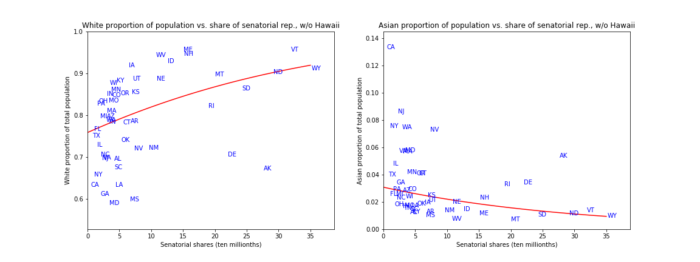
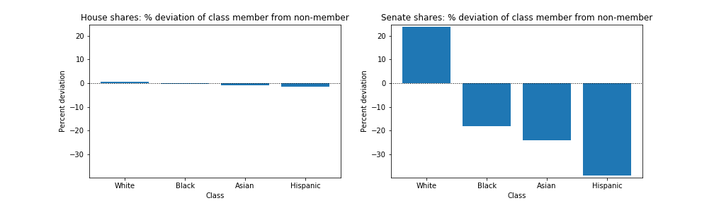

# Congressional representation by race
In the bicameral United States Congress, the citizens of each state share amongst them two senators. Thus, the citizens of a state with a smaller population each may be said to enjoy a greater "share" of senatorial representation than citizens of a larger state. Though representation in the House of Representatives is more closely tied to population, it remains the case that citizens differ in the share of representation they enjoy in the House.

**The goal of this work** is to examine to what extent, in the 113th and 115th Congresses (respectively, 2013-2014 and 2017-2018), the share of representation enjoyed by the average citizen varied by race or ethnicity.

**Share of representation** is defined as follows. Where $n_s$ is the population of state $s$, each citizen of state $s$ is said to enjoy $2/n_s$ shares of senatorial representation. Where $n_c$ is the population of congressional district $c$, each citizen of $c$ is said to enjoy $1/n_c$ shares of House representation.

## Files
[The Jupyter notebook Representation_by_race.ipynb](Representation_by_race.ipynb) contains all the data munging, as well as the code to make the plots that appear in this report. All code was written using Python 3.

This repository also contains spreadsheets which have the relevant Census data from the 113th and 115th Congresses, the plots generated by the Jupyter notebook, and the file [states_dict.py](states_dict.py) which merely defines a dictionary linking states to their two-letter abbreviations.

## 113th Congress results

The differing levels of representation enjoyed by each of the four categories is represented in the following figure. Here, for both the House and the Senate, the average shares of representation for citizens of each category is compared to the average shares of representation of non-members of that category. So, for example, the barplot shows that whites have on average almost 22.5% more shares of Senators than do non-whites. Hispanics have almost 39.5% fewer shares of Senators than do non-Hispanics.

By contrast, there is almost no difference in representation between the categories with respect to the House. 

Another perspective on the relationship between a given class and Senate representation can be gained by examining a scatterplot showing, for each state, the proportion of the population that is in that class along with the number of shares of Senators that each citizen has in that state. Given the above barplot, we might expect that (e.g.) citizens of higher-proportion white states will enjoy more shares of Senate representation than citizens of low-proportion white states. Indeed we do see that, in the following figure. In addition to the scatterplot, a logistic regression of class proportion on shares of representation appears as a red curve.

Hawaii is a major outlier in its low white population and high asian population. It is therefore of interest to look at the same scatterplots and logistic regressions with Hawaii removed, for the white and asian categories. The result is in the following figure.

## 115th Congress results

The results for the 115th Congress are very similar to those for the 113th. The barplot showing average gain in representation for each category over its complement is as follows:

Here, whites enjoy almost 23.8% more Senate representation than non-whites, and hispanics have over 38.8% less Senate representation than do non-hispanics. These numbers are similar to the corresponding values from the 113th Congress (22.5% and 39.5%, respectively).

The scatterplots showing category proportion versus Senatorial shares in each state are also similar for the 115th Congress and the 113th. The scatterplots for the 115th Congress are below, again with trendlines found by logistic regression included.

And again, I provide the scatterplots for the white and asian categories with Hawaii removed:
.

## Conclusion

Indeed there are enormous differences in Senate representation across racial/ethnic categories. On average, white citizens enjoy a vast advantage over nonwhite citizens in their proportionate control of the Senate. Blacks, asians, and hispanics on average all have less Senate representation than their respective complements in the population. Hispanics fare worse, with around 39% less Senate representation than non-hispanics.

These racial disparities are not present in House representation. Racial/ethnic discrepancies there are almost nonexistent. The largest discrepancy seen in the data here is that for hispanics in the 115th Congress, who had about 1.4% less House representation than non-hispanics.

Recall too that these results do not include the District of Columbia or any American territories. Since those regions all include American citizens who have no Senate representation, and since those regions are all minority white, including them in the results here would only exacerbate the extent to which white U.S. citizens are advantaged in Senate represenation over non-whites. It would be interesting, as a next step, to examine what would be the effect on the results gathered here of granting statehood to D.C. and the various territories.
